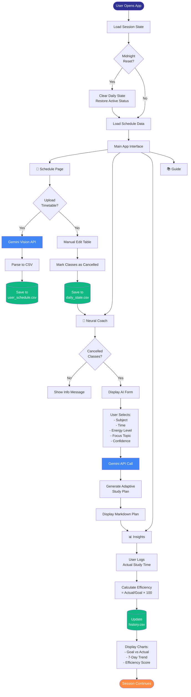
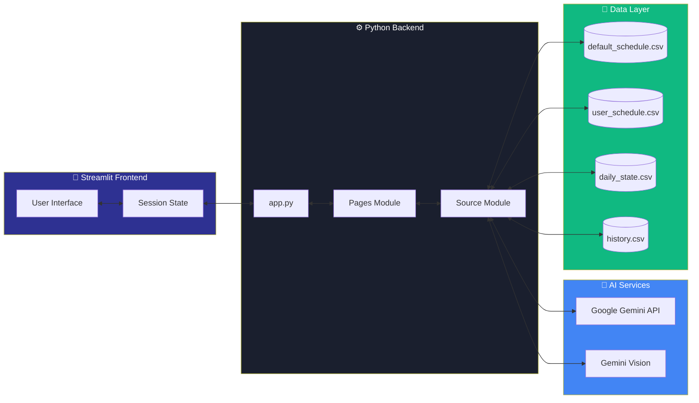
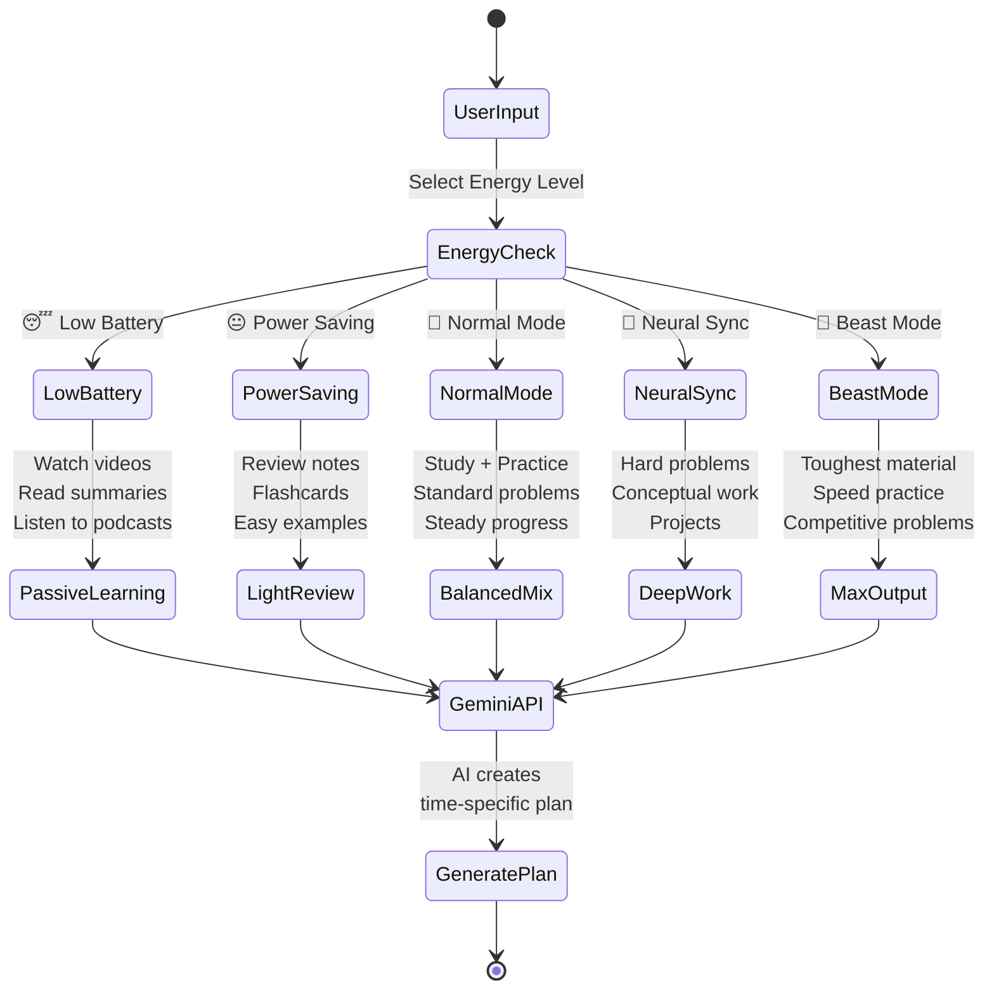

<div align="center">


# 🧠 Neural Plan

**Transform Cancelled Classes into Productive Study Sessions**

[](LICENSE)
[](https://www.python.org/downloads/)
[](https://streamlit.io)
[](https://ai.google.dev/)

*An AI-powered study planner that adapts to your energy levels and turns wasted time into learning opportunities*

[Features](#-features) • [Quick Start](#-quick-start) • [Architecture](#-architecture) • [Usage](#-usage) • [License](#-license)

</div>

---

## 🎯 The Problem

Students lose **hours every week** to cancelled classes, often defaulting to social media scrolling instead of productive study. Traditional planners don't account for:
- ⚡ **Variable energy levels** throughout the day
- 🎲 **Unpredictable schedule changes**
- 📊 **Lack of accountability** for actual vs. planned work

## 💡 The Solution

**Neural Plan** uses Google Gemini AI to generate **energy-adaptive study plans** that match your current mental state, from "Low Battery 😴" to "Beast Mode 🦁". Track your actual progress and build accountability through data-driven insights.

---

## ✨ Features

### 🤖 AI-Powered Study Plans
- **5 Energy Modes**: Plans adapt from passive learning (videos, reading) to intense problem-solving based on your state
- **Personalized Content**: Specify focus topics and confidence levels for surgical precision
- **Minute-by-Minute Breakdown**: Structured timelines with built-in breaks

### 📸 Vision AI Timetable Parser
- Upload timetable images or PDFs
- Automatic schedule extraction using Gemini Vision
- Instant digitization of your weekly classes

### 📊 Accountability Dashboard
- **Efficiency Tracking**: Compare planned vs. actual study time
- **7-Day Trends**: Visualize patterns in your productivity
- **Historical Analytics**: Export data for deeper analysis

### 🎨 Modern UI/UX
- Glassmorphism design with particle.js animations
- Dark theme optimized for extended use
- Responsive layout for all screen sizes

---

## 🚀 Quick Start

### Prerequisites
- Python 3.8 or higher
- Google Gemini API key ([Get one here](https://ai.google.dev/))

### Installation

```bash
# Clone the repository
git clone https://github.com/YOUR_USERNAME/NeuralPlan.git
cd NeuralPlan

# Install dependencies
pip install -r requirements.txt

# Configure API key
mkdir -p .streamlit
echo 'GEMINI_API_KEY_1 = "your_api_key_here"' > .streamlit/secrets.toml

# Run the app
streamlit run app.py
```

The app will open at `http://localhost:8501`

### First-Time Setup
1. **Upload Schedule**: Go to Schedule page → Upload timetable image or edit manually
2. **Mark Cancellations**: Change class status to "Cancelled" when needed
3. **Generate Plan**: Visit Neural Coach → Select subject, time, and energy level
4. **Track Progress**: Log actual study time in Insights page

---

## 📁 Repository Structure

```
NeuralPlan/
├── app.py                      # Main entry point with session state management
├── requirements.txt            # Python dependencies
├── LICENSE                     # MIT License
│
├── .streamlit/
│   ├── config.toml            # Streamlit theme configuration
│   └── static/
│       └── logo.png           # App logo
│
├── assets/
│   ├── logo.png               # Main logo image
│   ├── animation.json         # Lottie animation data
│   ├── style.css              # Global styles with glassmorphism
│   ├── stylesh.css            # Schedule page specific styles
│   ├── neural_coach.css       # Neural Coach page styles
│   └── data_page.css          # Insights page styles
│
├── data/
│   ├── default_schedule.csv   # Sample timetable (14 classes)
│   └── history.csv            # Sample historical data
│
├── pages/
│   ├── 1_Schedule.py          # Schedule management & upload
│   ├── 2_Neural_Coach.py      # AI study plan generator
│   ├── 3_Insights.py          # Analytics & progress tracking
│   └── 4_Guide.py             # User documentation
│
└── src/
    ├── __init__.py
    ├── gemini_client.py       # Google Gemini API integration
    ├── logo_helper.py         # Logo rendering utilities
    └── utils.py               # Helper functions (time conversion, etc.)
```

---

## 🏗️ Architecture

### System Flow Diagram



### Data Flow Architecture



### Energy-Adaptive AI Logic



---

## 🛠️ Tech Stack

| Component | Technology | Purpose |
|-----------|-----------|---------|
| **Frontend** | Streamlit 1.39+ | Rapid web app development |
| **AI Engine** | Google Gemini Flash | Study plan generation & OCR |
| **Data Viz** | Plotly 5.24+ | Interactive charts & graphs |
| **Animations** | Lottie, Particles.js | UI enhancements |
| **Storage** | CSV files | Lightweight data persistence |
| **Language** | Python 3.8+ | Core application logic |

---

## 📖 Usage

### 1. Schedule Management
- **Upload**: Drop timetable image → AI extracts schedule
- **Edit**: Click cells to modify times, subjects, durations
- **Cancel**: Change status to "Cancelled" when class is cancelled
- **Save**: Click "Save Daily Status" to persist changes

### 2. Generate AI Study Plans
Navigate to **Neural Coach** page:

```python
# Example: 60-minute cancelled Calculus class
Subject: "Calculus"
Focus Topic: "Derivatives chain rule"
Confidence: 4/10 (beginner)
Time: 60 minutes
Energy: "Normal Mode 🙂"

# AI generates:
# 0-15 min: Watch Khan Academy video on chain rule basics
# 15-30 min: Work through 5 simple examples
# 30-35 min: Break (stretch, water)
# 35-50 min: Practice 10 problems from textbook
# 50-60 min: Review mistakes and create summary notes
```

### 3. Track Accountability
In **Insights** page:
- Log actual study minutes (be honest!)
- View efficiency score: `(Actual / Goal) × 100`
- Analyze 7-day trends
- Export historical data

---

## 🎨 Energy Modes Explained

| Mode | Energy Level | AI Suggests | Best For |
|------|-------------|-------------|----------|
| 😴 **Low Battery** | Exhausted | Videos, podcasts, reading | Late night, post-workout |
| 😐 **Power Saving** | Tired | Review notes, flashcards | After lunch dip |
| 🙂 **Normal Mode** | Moderate | Balanced study + practice | Default state |
| 🧘 **Neural Sync** | Focused | Hard problems, deep work | Morning, peak hours |
| 🦁 **Beast Mode** | Peak | Toughest material, speed drills | High-energy periods |

---

## 🔧 Configuration

### API Keys
Add multiple keys for rate limit failover:

```toml
# .streamlit/secrets.toml
GEMINI_API_KEY_1 = "your_primary_key"
GEMINI_API_KEY_2 = "your_backup_key"
GEMINI_API_KEY_3 = "your_tertiary_key"
```

### Theme Customization
Edit `.streamlit/config.toml`:

```toml
[theme]
primaryColor = "#FF8C42"        # Accent color
backgroundColor = "#0E1117"      # Main background
secondaryBackgroundColor = "#1a1f2e"  # Card backgrounds
textColor = "#e8eaed"           # Text color
```

---

## 📊 Data Files

### Schedule Format (`user_schedule.csv`)
```csv
Day,Time,Subject,Duration,Status,Actual_Study,Custom_Subject
Monday,09:00 AM,Data Structures,60,Active,0,
Monday,10:00 AM,Calculus II,60,Cancelled,45,Derivatives
```

### History Format (`history.csv`)
```csv
Date,Time_Saved,Time_Used,Efficiency,Classes_Cancelled
2025-01-01,120,90,75,2
```

---

## 🤝 Contributing

Contributions are welcome! Please follow these steps:

1. Fork the repository
2. Create a feature branch (`git checkout -b feature/AmazingFeature`)
3. Commit changes (`git commit -m 'Add AmazingFeature'`)
4. Push to branch (`git push origin feature/AmazingFeature`)
5. Open a Pull Request

---

## 🐛 Troubleshooting

### AI Not Generating Plans
- **Solution**: Check API key in `.streamlit/secrets.toml`
- **Solution**: Wait 5 minutes (rate limit cooldown)
- **Solution**: Verify internet connection

### Timetable Upload Failed
- **Solution**: Use high-resolution, well-lit images
- **Solution**: Try PDF format instead
- **Solution**: Manually edit if OCR fails

### Efficiency Shows 0%
- **Solution**: Ensure class is marked "Cancelled" in Schedule page
- **Solution**: Click "Save Progress" after logging time

---

## 📝 License

This project is licensed under the MIT License - see the [LICENSE](LICENSE) file for details.

---

## 👨‍💻 Author

**Yuvraj Sarathe**

Built in 7 days for a hackathon challenge.

---

## 🙏 Acknowledgments

- [Google Gemini](https://ai.google.dev/) for AI capabilities
- [Streamlit](https://streamlit.io/) for rapid prototyping
- [Plotly](https://plotly.com/) for data visualization
- [Particles.js](https://vincentgarreau.com/particles.js/) for animations

---

<div align="center">

**⭐ Star this repo if Neural Plan helped you reclaim wasted time!**

Made with ❤️ and ☕ by [Yuvraj Sarathe](https://github.com/YOUR_USERNAME)

</div>
