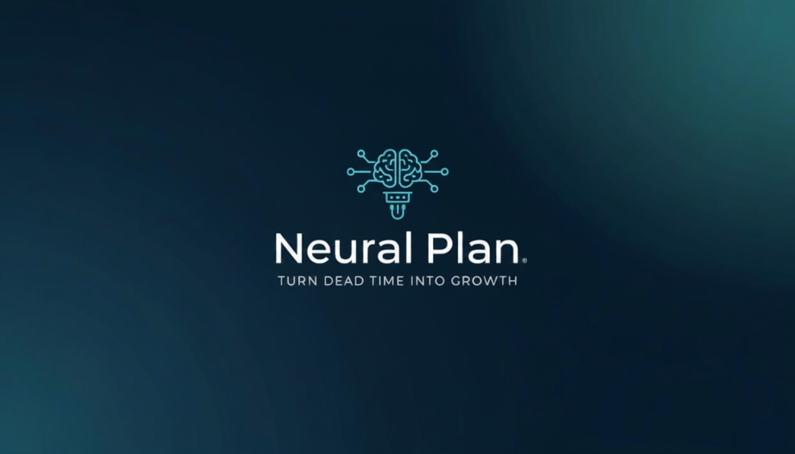
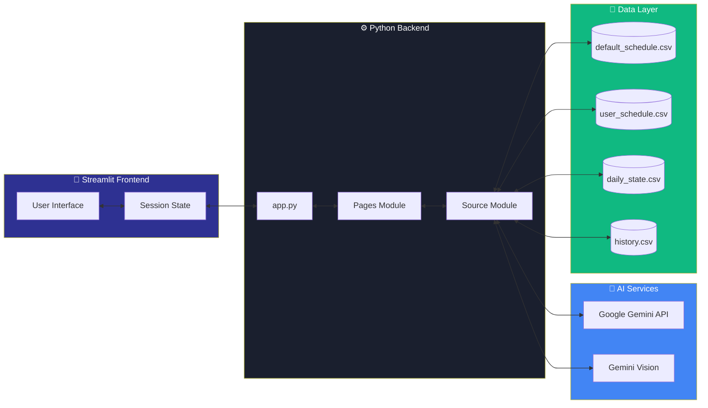
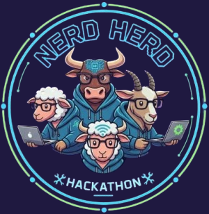

<div align="center">



# 🧠 Neural Plan

**Transform Cancelled Classes into Productive Study Sessions**

[](LICENSE)
[](https://www.python.org/downloads/)
[](https://streamlit.io)
[](https://ai.google.dev/)

*An AI-powered study planner that adapts to your energy levels and turns wasted time into learning opportunities*

[Features](#-features) • [Quick Start](#-quick-start) • [Architecture](#-architecture) • [Usage](#-usage) • [License](#-license)

</div>

---

## 🎯 Overview

Students waste hours on cancelled classes scrolling social media. **Neural Plan** uses Google Gemini AI to generate energy-adaptive study plans that match your mental state (Low Battery 😴 → Beast Mode 🦁) and track accountability through data-driven insights.

---

## ✨ Features

- **🤖 AI Study Plans**: 5 energy modes with minute-by-minute breakdowns
- **📸 Vision Parser**: Upload timetable images for automatic extraction
- **📊 Accountability**: Track efficiency with goal vs. actual comparisons
- **🎨 Modern UI**: Glassmorphism design with particle.js animations

---

## 🚀 Quick Start

### Prerequisites
- Python 3.8 or higher
- Google Gemini API key ([Get one here](https://ai.google.dev/))

### Installation

```bash
# Clone the repository
git clone https://github.com/Mikky-mlh/NeuralPlan.git
cd NeuralPlan

# Install dependencies
pip install -r requirements.txt
```

<details>
<summary><b>🔐 API Key Configuration (Click to expand)</b></summary>

<br>

**Important**: Never commit your API keys to version control!

1. Create the secrets file:
```bash
mkdir .streamlit
```

2. Create `.streamlit/secrets.toml` and add your key:
```toml
GEMINI_API_KEY_1 = "your_actual_api_key_here"
```

3. The `.gitignore` already excludes this file from git

**Optional**: Add backup keys for rate limit failover:
```toml
GEMINI_API_KEY_1 = "primary_key"
GEMINI_API_KEY_2 = "backup_key"
GEMINI_API_KEY_3 = "tertiary_key"
```

</details>

```bash
# Run the app
streamlit run app.py
```

The app will open at `http://localhost:8501`

### First-Time Setup
1. Upload timetable or edit manually in Schedule page
2. Mark classes as "Cancelled" when needed
3. Generate AI study plan in Neural Coach
4. Log actual time in Insights page

---

## 📁 Repository Structure

```
NeuralPlan/
├── app.py                      # Main entry point with session state management
├── requirements.txt            # Python dependencies
├── LICENSE                     # MIT License
│
├── .streamlit/
│   ├── config.toml            # Streamlit theme configuration
│   └── static/
│       └── logo.png           # App logo
│
├── assets/
│   ├── logo.png               # Main logo image
│   ├── animation.json         # Lottie animation data
│   ├── style.css              # Global styles with glassmorphism
│   ├── stylesh.css            # Schedule page specific styles
│   ├── neural_coach.css       # Neural Coach page styles
│   └── data_page.css          # Insights page styles
│
├── data/
│   ├── default_schedule.csv   # Sample timetable (14 classes)
│   └── history.csv            # Sample historical data
│
├── pages/
│   ├── 1_Schedule.py          # Schedule management & upload
│   ├── 2_Neural_Coach.py      # AI study plan generator
│   ├── 3_Insights.py          # Analytics & progress tracking
│   └── 4_Guide.py             # User documentation
│
└── src/
    ├── __init__.py
    ├── gemini_client.py       # Google Gemini API integration
    ├── logo_helper.py         # Logo rendering utilities
    └── utils.py               # Helper functions (time conversion, etc.)
```

---

## 🏗️ Architecture

### System Flow Diagram


### Data Flow Architecture



```

---

## 🛠️ Tech Stack

| Component | Technology | Purpose |
|-----------|-----------|---------|
| **Frontend** | Streamlit 1.39+ | Rapid web app development |
| **AI Engine** | Google Gemini Flash | Study plan generation & OCR |
| **Data Viz** | Plotly 5.24+ | Interactive charts & graphs |
| **Animations** | Lottie, Particles.js | UI enhancements |
| **Storage** | CSV files | Lightweight data persistence |
| **Language** | Python 3.8+ | Core application logic |

---

## 📖 Usage

**Schedule**: Upload timetable image or manually edit → Mark cancelled classes → Save

**Neural Coach**: Select subject, time, energy level, focus topic → Generate AI plan

**Insights**: Log actual study minutes → View efficiency score `(Actual/Goal × 100)` → Analyze trends

---

## 🔧 Configuration

<details>
<summary><b>Theme Customization</b></summary>

Edit `.streamlit/config.toml`:

```toml
[theme]
primaryColor = "#FF8C42"
backgroundColor = "#0E1117"
secondaryBackgroundColor = "#1a1f2e"
textColor = "#e8eaed"
```

</details>

<details>
<summary><b>Data Files Format</b></summary>

**Schedule** (`user_schedule.csv`):
```csv
Day,Time,Subject,Duration,Status,Actual_Study,Custom_Subject
Monday,09:00 AM,Data Structures,60,Active,0,
```

**History** (`history.csv`):
```csv
Date,Time_Saved,Time_Used,Efficiency,Classes_Cancelled
2025-01-01,120,90,75,2
```

</details>

---

## 🐛 Troubleshooting

- **AI not generating**: Check API key, wait 5 min (rate limit), verify internet
- **Upload failed**: Use high-res images, try PDF, or edit manually
- **0% efficiency**: Mark class as "Cancelled" in Schedule, click "Save Progress"

---

## 📝 License

This project is licensed under the MIT License - see the [LICENSE](LICENSE) file for details.

---

## 👥 Team Nerd Herd

<div align="center">



**Built in 7 days for a hackathon challenge by:**

</div>

<table>
  <tr>
    <td align="center">
      <a href="https://github.com/SourabhX16">
        <br />
        <sub><b>Sourabh Patne</b></sub>
      </a><br />
      <a href="https://github.com/SourabhX16">GitHub</a> • <a href="http://linkedin.com/in/sourabh-patne-2385733a3">LinkedIn</a>
    </td>
    <td align="center">
      <a href="https://github.com/siddhikadhanelia">
        <br />
        <sub><b>Siddhika Dhanelia</b></sub>
      </a><br />
      <a href="https://github.com/siddhikadhanelia">GitHub</a> • <a href="https://www.linkedin.com/in/siddhika-dhanelia-20a67334a/">LinkedIn</a>
    </td>
  </tr>
  <tr>
    <td align="center">
      <a href="https://github.com/majorsandeep11">
        <br />
        <sub><b>Shlok Pandey</b></sub>
      </a><br />
      <a href="https://github.com/majorsandeep11">GitHub</a> • <a href="https://in.linkedin.com/in/shlok-pandey-4902a83a2">LinkedIn</a>
    </td>
    <td align="center">
      <a href="https://github.com/Mikky-mlh">
        <br />
        <sub><b>Yuvraj Sarathe</b></sub>
      </a><br />
      <a href="https://github.com/Mikky-mlh">GitHub</a> • <a href="https://www.linkedin.com/in/yuvraj-sarathe">LinkedIn</a>
    </td>
  </tr>
</table>

---

<div align="center">

**⭐ Star this repo if Neural Plan helped you reclaim wasted time!**

Made with ❤️ and ☕ by **Team Nerd Herd**

</div>

